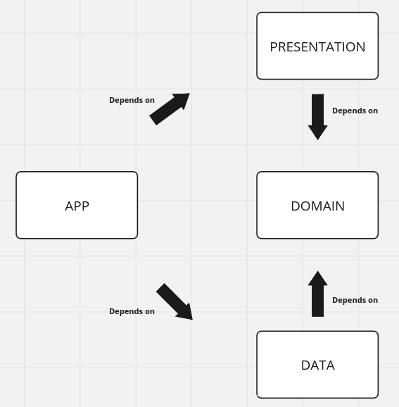

# SearchAnywhere
Android app to quickly find and open settings, apps and files.


## Architecture



__Uses__:
* Compose
* View models
* Kotlin Flows
* Room
* Hilt dependency injection

## Building the Rust library
Note that building the Rust library is not required to build the app in Android studio as the compiled native libraries are checked in to the repo.

To build the Rust library to the following :
* Install the latest stable Rust with rustup (https://www.rust-lang.org/tools/install)
* Install the Android NDK version 25.1.8937393 (Android Studio -> Settings -> Android SDK -> SDK Tools -> Show Package Details -> NDK (Side by side) -> 25.1.8937393)
* Add targets with rustup:
```
rustup target add \
  aarch64-linux-android \
  armv7-linux-androideabi \
  i686-linux-android \
  x86_64-linux-android
```
* Add the following to `~/.cargo/config` (replace NDK_INSTALL_DIR with the absolute path of the NDK directory):
```
[target.aarch64-linux-android]
linker = "NDK_INSTALL_DIR/25.1.8937393/toolchains/llvm/prebuilt/linux-x86_64/bin/aarch64-linux-android30-clang"

[target.armv7-linux-androideabi]
linker = "NDK_INSTALL_DIR/25.1.8937393/toolchains/llvm/prebuilt/linux-x86_64/bin/armv7a-linux-androideabi30-clang"

[target.i686-linux-android]
linker = "NDK_INSTALL_DIR/25.1.8937393/toolchains/llvm/prebuilt/linux-x86_64/bin/i686-linux-android30-clang"

[target.x86_64-linux-android]
linker = "NDK_INSTALL_DIR/25.1.8937393/toolchains/llvm/prebuilt/linux-x86_64/bin/x86_64-linux-android30-clang"
```
* Run the tests: `cd anlocate && cargo test`
* Build all native libs and copy to jniLibs dir: `./gradlew copyAnlocateLibs`
